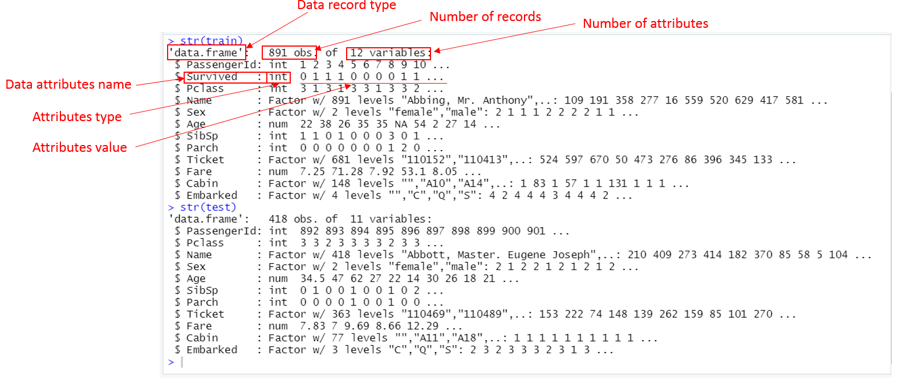

# Understand Data


```{r fig.align = 'center', out.width = "80%", echo=FALSE, fig.cap ="" }

knitr::include_graphics(here::here("images", "buildingmaterial.png"))

```

Understand your building raw materials can help you choose correct tools and make the most use of them to construct your ideal buildings. 

**Understand data** is the foundation for solving analytical problems. The two major purposes of understand data are: 

1. Access data quantity 
2. Access data quality 
3. Set up objects for data preprocess

In practice the two initial data assessments can be done together or separately. The purpose of them is to setup objective for data preprocess to accomplish. The methods used to understand data can be both Descriptive analysis and Exploratory analysis.

## Load data 

Here are my initial plan for understand Titanic data:

1. Get Titanic data load into RStudio
2. Assess Data quantity (number of files, size of each file in number of records, number of attributes in each record)
3. Attributes types assessment
4. Attributes value assessment (numbers and summary, description).

Now, get your RStudio ready. 

If you have not done the Exercises 2.5, which asked you to create a new R project named "MyDataScienceProject". You can do it now.

Open your RStudio, Click File-> New project->New Directory -> choose New R Project", then, enter "MyDataScienceProject" in the Directory name box and select your directory. Click "Create Project" at the right bottom as shown in Figure \@ref(fig:newproject) 


```{r newproject, fig.align = 'center', out.width = "95%", fig.cap = "Create a new project in RStudio ", echo=FALSE }
knitr::include_graphics(here::here("img", "NewProject.png"))
```

Load file "TitanicDataScience1.R" into RStudio. create a new R file and name it "MyTitanicDataScience1". 

The protocol is you copy lines indicated from this tutorial "chunk" by "chunk" into your R file and run them. 

Okay let us start,

In your RStudio (WorkSpace), copy lines from "TitanicDataScience1.R" into your file "MyTitanicDataScience1",

```{r}
# Load raw data
train <- read.csv("train.csv", header = TRUE)
test <- read.csv("test.csv", header = TRUE)
```
You will see this in your Console,

```markdown
> train <- read.csv("train.csv", header = TRUE)
Error in file(file, "rt") : cannot open the connection
In addition: Warning message:
In file(file, "rt") :
  cannot open file 'train.csv': No such file or directory
> test <- read.csv("test.csv", header = TRUE)
Error in file(file, "rt") : cannot open the connection
In addition: Warning message:
In file(file, "rt") :
  cannot open file 'test.csv': No such file or directory
> 
```
Don't panic. let us look into it.

The first thing I want you to learn is to use RStudio help. Remember how to use it?

Now type **`? read.cvs`** in your Console, look at the Multifunction pane, the tab **Help** is auto selected and help message for **`read.cvs`** is appeared. See Figure \@ref(fig:Rhelp)


```{r Rhelp, fig.cap='Screen capture of Error and Help', out.width='95%', fig.asp=.75, fig.align='center', echo=FALSE }

knitr::include_graphics("img/Rhelp.png")

```

Now, notice that the error message says, "`cannot open file 'test.csv': No such file or directory`". We don't have file `train.csv` and `test.csv` in our working directory.

Now, Download the `traon.csv` and `test.csv` from Kaggle (if you did not download already) and stored into our project working directory^[The data files were asked to be downloaded and unzipped in the previous chapter \@ref(act-download) . If you simply unzip it into the working directory, it will exists in "~/Titanic/" directory. In this case, you need to move them into your working directory.].


Please note that it is a common practice that data scientist download datasets from data sources and save to a local drive. Having a local version of the raw datasets is good idea. But a lot of times, it is unfeasible to do so either because the data is too big or there are some access restriction prevent you have a local version. So, you have to using service provider's API or data URI through HTTP protocol or other protocol like FTP etc. 

Once, you have download the datasets from Kaggle website and unzipped (or moved) them into your local working directory, run the same code again by select them all and click "Run" or type "Ctr + Enter" .

You will see the two new attributes have been created and displayed in the **WorkSpace pane**. See Figure \@ref(fig:importdata).

```{r importdata, fig.cap='Screen capture of import raw data', out.width='95%', fig.asp=.75, fig.align='center', echo=FALSE }

knitr::include_graphics("img/importdata.png")

```


```{block2, ToDo41, type='rmdaction'}
Try yourself:

Import data from **WorkSpace pane** by click "**Import Dataset**" button.
```

## Assess Data Quantity 

After we have load the raw data into our WorkSpace, we can start to explore and exam the raw data.

In R code, the best way to explore a dataset and get the first impression on its size (number of records and numbers of attributes) is using `str()` function. If you wan tot know more about it, as I mentioned earlier, using help by typing `? str()` in your Console. There is an equivalent R code is called `help <statement>`, you can try `help str()`.

Now let us run the following code,

```
# Exam train and test datasets
train <- read.csv("train.csv", header = TRUE)
test <- read.csv("test.csv", header = TRUE)
```
You will see this in your console, Figure \@ref(fig:Rstr).

```{r Rstr, fig.cap='Screen capture of str(tain) and str(test)', out.width='130%', fig.asp=.75, fig.align='center', echo=FALSE }



```

Firstly, you will see the size of the two datasets: 

- train has **891 records** and each record has **12 attributes**. Okay, R uses statistics terminology, observation is record in data science term. properties of an observation are attributes of a record. Notice that train has a type of data.from. Data.frame is the most used data type in R. (Try `?data.frame` to explore)
- test has **418 records** and each record has **11 attributes**, which are less than train's in both number of records and attributes. 

Dataset `test` has less number of records makes sense because any model you need large data to train and less data to test ( it will become clear later). However, why `test` has one less attribute? compare with `train`, it is easy to find out that the missing attribute is *Survived*. Do you understand now? The dataset `test` is supposedly to be used for testing our model (we will have it later) for predicting passengers' have lived and dead. So, it should not have a value now. The entire problem is for us to come up with a value on the attribute.   

RStudio has a conveniently build-in function to explore data size. At the **WorkSpace pane**, you can see the under **Environment** tab, the two attributes we have created are listed there. In font of each attribute there is a 
 sign. click it you can exam its size and structure. It is equivalent to run `str()` R instruction. You can also lick on the attribute name to explore the entire dataset. 

```{block2,  type='rmdaction'}
Try yourself:

At RStudio **WorkSpace pane**, 

Click varaible name `train` and `test` to explore the contents of datasets.

Click on the  sign in front of attribute to explore it sstructure. 
```

## Data Attributes Assessment

After a brief assessment on the data quantity, we know that the both datasets are not too big in terms of both number records (891 and 418) and number of attributes (12 and 11). We also have an intuitive understand about the attributes, some obvious names like *Name*, *Sex* and *Age*; and some not so obvious names like *SibSp* and *Parch*. 

### General Attributes Description

Before we looking into individual attributes (single variate analysis) in our datasets, let us get some general sense of all attributes and make sure we understand each of them.

We knew that dataset `test` has 11 attributes and `train` has 12 attributes. The one attribute short is the *Survived*. The rest are the same. Let us look into those attributes, the following is from the Kaggel web site:

```{r  out.width='100%', fig.asp=.75, fig.align='center', echo=FALSE }

knitr::include_graphics("img/DatafrKaggle.png")

```

```
attribute Notes
*Pclass*: A proxy for socio-economic status (SES)
1st = Upper
2nd = Middle
3rd = Lower

*Age*: Age is fractional if less than 1. If the age is estimated, is it in the form of xx.5

*Sibsp*: The dataset defines family relations in this way...
*Sibling* = brother, sister, stepbrother, stepsister
*Spouse* = husband, wife (mistresses and fiancés were ignored)

*Parch*: The dataset defines family relations in this way...
Parent = mother, father
Child = daughter, son, stepdaughter, stepson
Some children travelled only with a nanny, therefore parch=0 for them.
```
Just looking into these attributes' description, a few thoughts are occurred:

1. Attribute types

There are attributes should be categorical types. The values of those attributes can be any types but the importance is that they can classify the records into sets of similar groups and this grouping make sense to the problem to be solved. In Titanic datasets, attributes should have **categorical** type are: *Survived*, *Sex*, *Embarked*, and *Pclass*.

Other attribute perhaps should have numerical type. Thsi is because these attributes values change from record  to record. They can be  the values of discrete, continuous, or timeseries. One thing in common is that these values can be manipulated and applied with many math functions and plotting tools for visualization. In Titanic datasets, attributes should have **numerical** type are: *Age*, *Fare*, *SibSp*, *Parch*. 

2. Contribution to Survive

The final goal is to predict passenger's survived or not. It makes sense to assess the prediction power of each attribute. which is the contribution of an attribute to attrribute *Survived*. In other words, the potential relationships among these attributes and with the attribute *Survived* need to be assessed. Here are some thoughts:

- *Pclass* should somehow linked with *Fare* and *Cabin*. Generally, the higher the class is and the more expensive of the fare will be and the better cabin locations are. So those should have some sort of correlations among them. they together should have some affect on survive. You would think that the expensive ticket, means better cabin location and has privilege to escape first in the disaster.  

- What is the ticket number to do with survive? Is it just a random number? Or is associated with cabin? Or anything else like Port of embarkation? ticket number in some other systems could have more information rather than just an unique number. 

- Is the *Fair* in someways associated with journey length, which means the Port of embarkation and the port of disembarkation? Or cabin location and condition? 

You can have other thoughts too. To prove or disprove these assumptions and thoughts, we need to look into the actual datasets at least to see:

1. What are the data types for various attributes?

  - Which attributes are available in the dataset?
  - Which attributes are categorical?
  - Which attributes are numerical?
  - Which attributes are mixed data types?

2. Any errors in the attributes values?

  - Which features may contain errors or typos?
  - Which features contain blank, null or empty values?

These questions will be answered in the following two sections. 


### Actual Attributes Types Examination

From figure \@ref(fig:Rstr), We can see that all the attributes have only three types, `int`, `Factor`, `num`.

Attributes have `int` types are: *PassengerId*, *Survived*, *SibSp*, *Parch*.

Attributes has  `Factor` types are: *Name*, *Sex*, *Ticket*, *Cabin* and *Embarked*.

Attributes has `num` types are: *Age* and *Fare*. 

We know that, the type `int` is for attribute that has an integer value; and `num` is for an numeric attribute, which has the values of real numbers.

Type `Factor` is R language's way to say category type. It is a attribute that can take on one of a limited, and usually fixed, number of possible values, such as blood type.

Attributes types affect the operations we can apply on that attributes. In other words inappropriate types can prevent us to do proper analysis on that attribute. For example, it doe's not make sense to calculate average on sex, so it is better to be with a type of Category, in R is a `Factor`. Similarly, *Survived* will have only two values 0 or 1, to represent death or live. It makes sense to be an `factor` too. Being a `int` type, it will prevent us to apply many methods that only works for a `Factor` type attribute. 

So, looking into data attributes types, compare with the original meaning of each attributes can help us to spot any inappropriate types or wrong types. 


```{block2,  type='rmdthinking'}
Thinking:

Is **Servived typed** `int` approriate?
  
What other attributes do you think are in a wrong type?
  
```

### Actual Data Attributes Value Examination

To understand given datasets needs to carefully examine the values of each data attributes to:

- find any errors and missing values
- find value distribution 
- find potential relation with the attribute to be predicted (also called dependent variable)

Finding errors, typos and missing values can set up the goals for data prepsocess. 

Since the examine covers both datesets `train` and `test`, it make sense to combine the two datasets into one big dataset, so it can save us to run the same code twice on the different datasets.

Copy the following code into your script,

```{r}
# Add a "Survived" attribute to the test dataset to allow for combining with train dataset

test <- data.frame(test[1], Survived = rep("NA", nrow(test)), test[ ,2:ncol(test)])

# Combine data sets. Append test.survived to train
data <- rbind(train, test)

```
Now we have a dataset `data`, which combines both datasets `train` and `test` datasets. We assigned the value of attribute *Survived* in the original dataset `test` as "NA". You can check them in the **WorkSpace pane** by click variable data.  

```{block2,  type='rmdtry'}
Thinking:

1. Can we combine `train` and `test` without add *Survived* attribute to the test? Like,

```data <- rbind(train, test)```

2. Why add attibute *Survived* as the second attribute? Can we add it as the first one? Like,

```test <- data.frame(Survived = rep("NA", nrow(test)), test[,])```

```

It is good idea to have bird eye's view on our combined dataset.

```{r}
# check out data with a summary
summary.data.frame(data)
```
This summary tell us a lot of information. Most obvious are:

1. *PassengerID* is useless in terms of predicting survived or not. in addition, it is not much help that provide a statistical summary on it. 
2. *Survived* and *Pclass* numbers are useful and interesting.
3. *Name* is mostly unique, which comes a surprise that only 2 names are repeated twice.
4. *Gender* distribution among passenger is unbalanced that male overweight female.
5. *Age* is interesting that minimum age 0.17 is alarming and there is 263 missing values.
6. *SibSp* tells us the largest relatives travel together is 8.
7. *ParCh* tells us the largest family travel together is 9.
8. There are large number of *ticket* has the same number. The most repeat number is CA. 2343, which has 11 duplicates. 
9. Ticket *Fare* shows the minimum is 0, which is interesting that someone take a free ride. The maximum is over 512, which is far too expensive when the mean value is only about 33. 
10. Both *Cabin* and *Embarked* have values which can be identified and need more investigation.

You can see now one function can provide so much information. Quantitative summary is a great tool for a data scientist. 

Now, Let us exam each attribute, 

 - **PassengerID**. *PassengerId* is an identifier, So only its uniqueness and missing value are considered.
 
There are many ways you can use to find out. I simply check its total number and its unique number. If the both equal to the number of records in the dataset, it shows that there is no duplication and no missing values in the attribute. 

So we do,
 
```{r}
# Exam PassengerID

length(data$PassengerId)
length(unique(data$PassengerId))

```
The results shows the both number 1309, which is equal to the total number of records in the dataset. It proves the *PassengerID* has not missing value and duplication. 

- **Survived**. *Survived* is the attribute that its value will be produced by a model for the dataset `test`. It is called **Consequencer** in modeling contrast with other attributes. which are used to produce a prediction, are called **Predictor**.  So, our exam will be conducted only on dataset `train`. Again we can check the numbers whether they can add up or not. As we already mentioned that it makes sense to change the *Servived* from type `chr` into `Factor`. We do,

```{r} 
# Exam Survived
data$Survived <- as.factor(data$Survived)
table(data$Survived)
```
The results proved that the *Survived* value has the correct numbers: 

- 418 'NA' values are the *Survived*'s value in the  dataset `test`, and
- the 549 death and 342 survived, together maded up the total number of dataset `train `, which is 891. 

So we know the value of *Survived* in the dataset `train` are correct and has no missing values. It is interesting here to think about the survive rate. How to calculate? 

I will do this,
```{r}
# Calculate the survive rate in train data is 38% and the death rate is 61.61%
prop.table(table(as.factor(train$Survived)))
```
So we know the survive rate in the dataset `train` is about 61%. This is interesting because it reflects the overall survival rate.

- **Pclass**. *Pclass* is the feature which splits the passengers into three division namely class-1, class-2, class-3. As we understood it should be in type of `Factor` rather than `int`. We shall change its type first and then to see if there missing value or errors. It is also good to know the survival rate in each class. So. we can compare with the overall survival rate in the dataset `train`.

Copy the following code into your script.
```{r}
# Examine Pclass value,
# Look into Kaggle's explanation about Pclass: it is a proxy for social class i.e. rich or poor
# It should be factor and it does not make sense to stay in int.
data$Pclass <- as.factor(data$Pclass)
test$Pclass <- as.factor(test$Pclass)
train$Pclass <- as.factor(train$Pclass)

# Distribution across classes
table(data$Pclass)

```
If you want, you can check the total of the three classes which is 1309. It equals to the total number of records in the `data` (total number fo passenger). And there is no other numbers than 1,2 and 3. So we can conclude that there is no missing value and no errors in *Pcalss*.

It will be interesting to see the survival rate for each class,
```{r}
# Distribution across classes with survive
table(data$Pclass, data$Survived)
```
These numbers tell us many things: 

1. **The death distribution**. Among the three classes from class-1 to class-3 is: 80, 97 and 379. It confirms that the passenger in Class-3 has largest number of death (372);

2. **The survival distribution**. Among the three classes, class-1 has the highest number of survival (136);

3. **The passengers distribution**. Among the three classes, class-3 has the largest passenger numbers (372+119+218) in total, and overtaking other two classes together for both datasets `train` and `test` (372+119) > ((80+97) + (136+87)). 

4. The last column is the pasenger distribution among the three glasses for dataset `test`. This is because its *Survived* value is "NA" (not defined).

We can calculate distributions among the three classes in terms of percentage. 

1. The overall passenger's distribution among the three classes:
```{r}
# Calculate the distribution on Pclass
# Overall passenger distribution on classes.
prop.table(table(as.factor(data$Pclass)))
```
That is 24.67% passenger in Class-1, 21.16% passenger is class-2 and 54.16% of passenger in class-3.

2. The passenger's distribution among the three classes given by dataset `train`:
```{r}
# Train data passenger distribution on classes.
prop.table(table(as.factor(train$Pclass)))
```
The number tells us the distribution of passengers from  dataset `train` is: class-1, 24.24%; class-2, 20.65% and class-3 has 55.1%.

3. The passenger's distribution among the three classes given by dataset `test`:

```{r}
# Test data passenger distribution on classes.
prop.table(table(as.factor(test$Pclass)))
```
Lastly, the passenger distribution from dataset `test` are: 25.6% in class-1, 22.24% in class-2 and 52.15% percent in class-3.

We can see that the distribution of passengers, in terms of percentage, among the three classes are almost identical both in order and in proportion. That is the most passenger are in class-3, then class-1 and finally class-2.

Let us look into death and survive distribution among the three classes^[This code is not brilliant. It used many intermediate variables, you can check their structure and contents from **WorkSpace pane**. You can come up with a better code.],
```{r}
# Calculate death distribution across classes with Train data
SurviveOverClass <- table(train$Pclass, train$Survived)
# Convert SurviveOverClass into data frame
SoC.data.fram <- data.frame(SurviveOverClass) 
# Retrieve death distribution in classes
Death.distribution.on.class <- SoC.data.fram$Freq[SoC.data.fram$Var2==0]
prop.table(Death.distribution.on.class)
```
These numbers tell us the distribution of death among the three classes are: 14.57% death from class-1, 17.66% from class-2 and 67.75% death from class-3. 

Similarly, we can calculate survive distribution among the three classes, 

```{r}
# calculate survive distribution among the three classes
Survive.distribution.on.class <- SoC.data.fram$Freq[SoC.data.fram$Var2==1]
prop.table(Survive.distribution.on.class)
```
The results tell us that 39.76% of survived passenger are from class-1, and 25.43% from class-2, and 34.79% from class-3.

Let us thinking about this numbers. Class-3 has 55.1% of passenger distribution but has 34.79% passenger survival distribution. Clearly, the survive rate in class-3 is lower than other two classes. It is equivalent to say, **the survival chances of a passenger who is in class-1 are higher than who is a class-2 and class-3**.

```{block2,  type='rmdaction'}
Do it yourself:
  
Calculate the Survival rate among the three classes. What conclusion you have by compare them?
```

Numbers are good to provide summary and test some assumptions. Analyzing given data by means of statistical summary and other numbering methods is called **Descriptive analysis**. See section \@ref(analyse) .

Perhaps, it is a good time to introduce **Exploratory analysis**, on the contrast with the Descriptive analysis, it uses graphical tools to explore the inside of given datasets.

To do so, we need to import some useful graphical tools provided by R community. We can then use them plot *Survived* as an factor on Pclass numbers.

```{r Survivalrate, fig.cap = "Total count and survive rate of passenger on Pcalss."}

# Load up ggplot2 package to use for visualizations
library(ggplot2)

ggplot(train, aes(x = Pclass, fill = factor(Survived))) +
  geom_bar(width = 0.5) +
  xlab("Pclass") +
  ylab("Total Count") +
  labs(fill = "Survived")
```

Graph is better, isn't it? It is very intuative. 

Let's briefly interpret this graph. The graph shown \@ref(fig:Survivalrate) tells us that the survive rate in Class-3 is the worst, and followed by class-2 and lastly, class-1. More people perished in the class-3 than any other two classes. It provides an important point that the chance of survive is associated with the **social glass**, if we can prove the Class-3 ticket is cheaper. 

To sum up the analysis with Pclass, We have used both **Descriptive analysis** and **Exploratory analysis**. The results suggested that **the *Pclass* has a strong relation with death rate**. That is passengers in Class-3 have a higher chance of death. The correlation with social class (richer or poor) is waiting to be proved if the class-3 ticket is cheaper than others.  

 - **Name**. *Name* attribute by definition shows peoples' name. It should not have any impact on passengers' lived or dead, shouldn't it? It may only have more chance of errors and typos since the long characters rather than anything predictive for the survival. 
 
Firstly, you may notice that the type of *Name* is a `Factor`, which we really don't want. Factor shows the uniqueness, it can prevent us to explore the details of its content, which naturally are characters or strings.
 To Explore *Name*, we will do,
```{r}
# Convert Name type
data$Name <- as.character(data$Name)
# Explore the contents
head(data$Name)
# You can check head function ?head
```
 
 

## Data recods level assessment

apart we ahve already known that the records numbers in the two datasets. It is interesting to know is there any invalid records or not. like dublicated records and records has obvious problems despit the attributes level exam has been doen already.   

## Summary {-}

In this section we have demonstrated the access of raw data and a brief assess of data quantity and data quality. Since our raw data is not do big in terms of both number fo records and the number of attributes. So it is relatively easy to assess their quality. In a real world project the raw data can be huge. To perform an effective analysis you may need to reduce the data size, which means you need to do sampling on the give data sets and probably attributes selection too. these topics are covered in the next tutorial on data preprocess.  

## Exercises 4 {-}

1. Identify the code in this tutorial which can be conceptually categorized as Descriptive analysis and which one can be Exploratory analysis?

2. Find out what is "rt" mean in R `train <- read.csv("train.csv", header = TRUE)` error message. Explore how to load files other than *csv* file.

3. Explore load data through RStudio build-in functions. Check "File -> Import Dataset", also check how to load data from a databases like MySql.

4. Calculate survival rate among the three Pclass.

5. Plot distributions of Fare, Embarked of passengers who survived or did not survive

6. Plot survival rate by Sex,Plot survival rate by Pclass, Plot survival rate by SibSp,Plot survival rate by Parch


